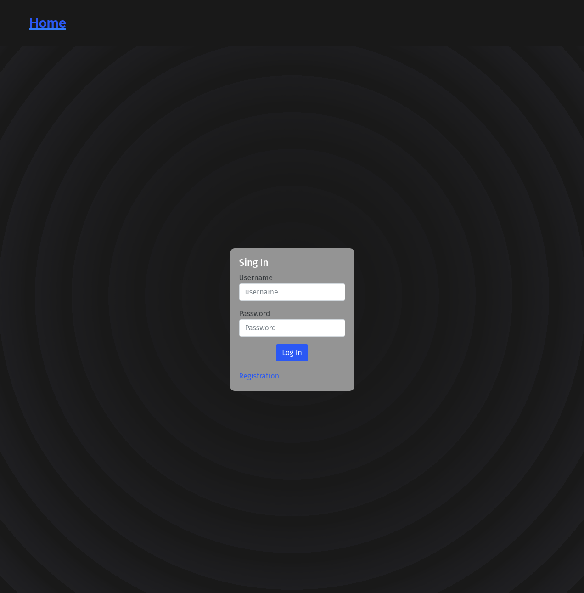
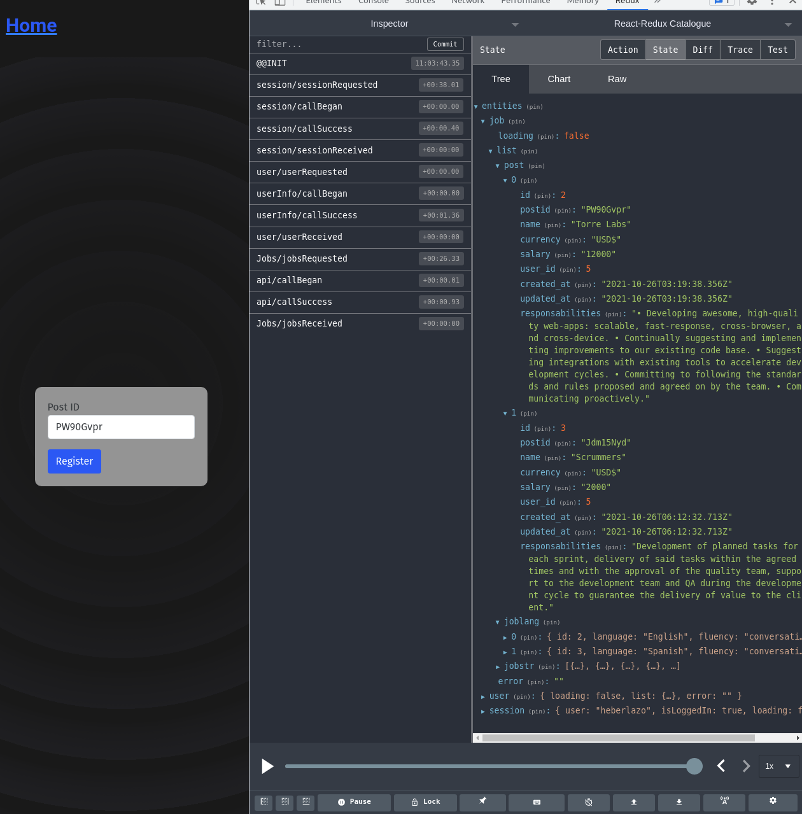

# React-Redux Torre-Api

Este proyecto tiene consume la Torre-Api, donde busca al usuario atraves del username.
El proceso de request lo hace atraves del back-end usando Rails-api.
Atraves del Redux se puede apreciar algunos detalles de la informacion personal de la app
Torre. Ademas tambien busca Post mendiante el codigo y regresa algunos detalles del Post del trabajo.

## WebSite Sections
- Esta captura es el Home, con un login de inicio, si no se tiene una cuenta es necesario registrarse

- Una vez que se hace el login o se registra, uno puede buscar un trabajo teniendo el codigo del post

## Live demo

- UNDER CONSTRUCTION

## Built With

- JavaScript
- HTML
- SCSS
- React
- Redux
- Bootstrap
- Package.json
- Rails-api Back-end

## How to start the project from your Local environment

- Open your terminal and cd where you want to store the project
- Run the following command - `git clone https://github.com/Wusinho/Torre-api ` for front-end
- Cd into the created directory 
- Run `npm install` to install all dependencies
- To run the pogram type `npm run dev` on your terminal.
- By default it will open in google-chrome however you can configure `./config/webpack.dev` to open it another browser.

For the purpose of the working app

- Create an account with the name 'heberlazo', set up a password
- search a job post example: 'PW90Gvpr' or 'Jdm15Nyd'

## Author

👤 **Heber Lazo**

- Github: [@Wusinho](https://github.com/Wusinho)
- LinkedIn: [Heber Lazo](https://www.linkedin.com/in/heber-lazo-benza-523266133/)

## 🤝 Contributing

Contributions, issues, and feature requests are welcome!

## Show your support

Give a star if you :star: like this project!

## Acknowledgments

- Microverse

## 📝 License

This project is [MIT](LICENSE) licensed.
